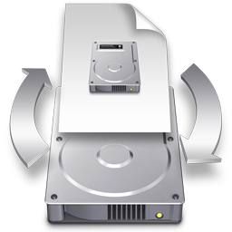

# FastDMG

FastDMG is a macOS utility to quickly and efficiently mount `.dmg` and other disk images without any unneeded nonsense. It is a very fast and reliable replacement for Apple's [DiskImageMounter](https://en.wikipedia.org/wiki/DiskImageMounter) app.

* **[Download FastDMG 1.0](https://sveinbjorn.org/files/software/FastDMG.zip)** (~1.2 MB, Intel 64-bit, 10.8 or later)

## Features

* Doesn't waste your precious time verifying disk images
* Auto-accepts annoying end user license agreements
* Runs in the background (doesn't show up in the Dock)
* Displays no windows or menus and stays out of your way
* Multithreaded and can concurrently mount several images
* Disk image document icons continue to look the same
* Handles all disk image types supported by DiskImageMounter (dmg, iso, smi, etc.)

FastDMG is a minimal wrapper around the [ `hdiutil`](https://developer.apple.com/legacy/library/documentation/Darwin/Reference/ManPages/man1/hdiutil.1.html) command line tool that ships with macOS. It therefore uses Apple's private DiskImages framework indirectly. It is free, open source software. If you like it, feel free to [make a donation](https://sveinbjorn.org/donations).

## How to use

* Move FastDMG.app to your Applications folder
* Select a `.dmg` file and press Cmd-I to show the Finder's Get Info window
* Select FastDMG under "Open with:"
* Press "Change All..."

FastDMG will then take care of mounting  `.dmg` disk images when you open them in the Finder. You can do the same for `.iso`, `.smi` and any other disk images supported by FastDMG.

## BSD License 

Copyright (C) 2012-2018 Sveinbjorn Thordarson &lt;<a href="mailto:">sveinbjorn@sveinbjorn.org</a>&gt;

Redistribution and use in source and binary forms, with or without modification,
are permitted provided that the following conditions are met:

1. Redistributions of source code must retain the above copyright notice, this
list of conditions and the following disclaimer.

2. Redistributions in binary form must reproduce the above copyright notice, this
list of conditions and the following disclaimer in the documentation and/or other
materials provided with the distribution.

3. Neither the name of the copyright holder nor the names of its contributors may
be used to endorse or promote products derived from this software without specific
prior written permission.

THIS SOFTWARE IS PROVIDED BY THE COPYRIGHT HOLDERS AND CONTRIBUTORS "AS IS" AND
ANY EXPRESS OR IMPLIED WARRANTIES, INCLUDING, BUT NOT LIMITED TO, THE IMPLIED
WARRANTIES OF MERCHANTABILITY AND FITNESS FOR A PARTICULAR PURPOSE ARE DISCLAIMED.
IN NO EVENT SHALL THE COPYRIGHT HOLDER OR CONTRIBUTORS BE LIABLE FOR ANY DIRECT,
INDIRECT, INCIDENTAL, SPECIAL, EXEMPLARY, OR CONSEQUENTIAL DAMAGES (INCLUDING, BUT
NOT LIMITED TO, PROCUREMENT OF SUBSTITUTE GOODS OR SERVICES; LOSS OF USE, DATA, OR
PROFITS; OR BUSINESS INTERRUPTION) HOWEVER CAUSED AND ON ANY THEORY OF LIABILITY,
WHETHER IN CONTRACT, STRICT LIABILITY, OR TORT (INCLUDING NEGLIGENCE OR OTHERWISE)
ARISING IN ANY WAY OUT OF THE USE OF THIS SOFTWARE, EVEN IF ADVISED OF THE
POSSIBILITY OF SUCH DAMAGE.
